 
# Hello, I'm Paolo! 👋
> Welcome to my GitHub profile! 😄  
> Here you can see my GitHub stats and get a glimpse of my coding journey. 🚀

 

    
    
    

> [!NOTE]
> 

 

> [!TIP]
> **RANDOM FACT**:  
> Odds of being killed by lightening? 1 in 2million/killed in a car crash? 1 in 5,000/killed by falling out of bed? 1 in 2million/killed in a plane crash? 1 in 25 million.

 
 

<h2>GitHub Stats</h2>

 
Feel free to explore my repositories and connect with me! 🤝
